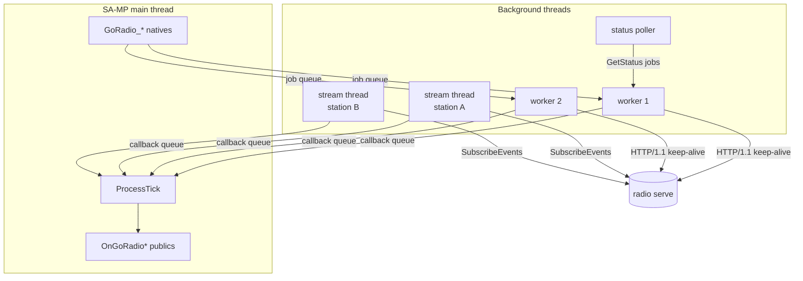

# Architecture & Threading

## The layout

Four kinds of thread:

**The main thread** runs your PAWN code. Natives execute here and must
never block, so each one either reads cached state or appends a job to a
queue and returns.

**Worker threads** (`goradio_workers`, default 2) run unary RPCs —
`QueueTrack`, `Skip`, `GetStatus`, everything except the event stream.
Each owns one keep-alive HTTP connection and one job at a time, so the
worker count is also how many RPCs can be in flight simultaneously.

**One stream thread per station** holds that station's `SubscribeEvents`
subscription open, and owns its registration lifecycle: initial
registration, reconnect with backoff, and re-registration after a drop.
This is separate from the worker pool because it is parked on a socket
read almost all of the time; putting it in the pool would permanently
consume a worker.

**The status poller** wakes every `goradio_poll_interval` seconds and
drops a `GetStatus` job for each station onto the job queue. It doesn't do
any I/O itself.

## Getting results back to PAWN

A worker cannot call a SA-MP public. So results never travel as objects or
pointers — each one is flattened into a plain-value event (strings and
numbers, nothing referencing state another thread might still be changing)
and pushed onto a callback queue.

`ProcessTick` drains that queue every server frame and fires the matching
publics. Callbacks are offered to the gamemode **and every loaded
filterscript**, so a filterscript can react to a station the gamemode
created.

This is why the delivery order you observe is: the audio server sends an
event, a stream thread parses it and queues a callback, and your public
runs on the next tick — typically within a few milliseconds.

## The status cache

Each station holds a snapshot: current track, queue, history, listener
count, uptime, flags. Two things keep it current.

**Events**, which are folded in the moment they arrive. `TRACK_STARTED`
replaces the current track outright, so `GoRadio_GetCurrentTrackTitle` is
right immediately rather than at the next poll.

**`GetStatus` snapshots**, which arrive on the poll timer, after every
registration, and after every track start and end. Only a snapshot carries
the full queue and history lists.

One nicety: `GoRadio_GetCurrentTrackElapsed` extrapolates. The snapshot
records when it was taken, and the getter adds the wall time since,
clamped to the track duration — so a progress bar advances smoothly
instead of jumping once per poll.

## Failure handling

**Transient failures retry with exponential backoff**, from 1s to a 30s
cap: the audio server being down, a connection dropping, a request timing
out.

**Permanent failures stop.** `unauthenticated`, `permission_denied` and
`invalid_argument` will fail identically no matter how many times they're
retried — they mean the token is wrong, the token doesn't cover the slug,
or the request is malformed. Retrying those produces a process that spins
forever on what is really a config mistake, so the station stops, logs the
reason, and fires [`OnGoRadioError`](../pawn-api/errors.md).

**A dead connection is noticed.** The event stream can legitimately sit
silent for minutes, so a read timeout can't distinguish "quiet" from
"dead". TCP keepalives do it instead: 20s idle, then probes. A connection
killed silently — a NAT timeout, a partition, anything that never sends a
FIN — surfaces as a read error within about a minute and triggers the
reconnect path.

## Shutdown

`Unload` blocks until every thread is joined, because letting a thread
outlive the shared library it lives in is how a server crashes on
shutdown.

To make that quick, threads are woken from their sockets rather than
waited out: each connection is interrupted, so a stream thread parked on
an idle read returns at once instead of sitting out its timeout. Backoff
sleeps are interruptible for the same reason — a station in a 30-second
backoff doesn't add 30 seconds to your shutdown.

Destroying a station follows the same order: stop and join its stream
thread first, then send `UnregisterStation`, so the teardown can't race
the unregister.

## Guarantees, and what isn't guaranteed

**Guaranteed:**

- No native blocks on the network.
- Callbacks only ever run on the main thread, from `ProcessTick`.
- Events from one station arrive in the order the audio server sent them.
- A station keeps trying to register until it succeeds or hits a
  permanent error.

**Not guaranteed:**

- That a command took effect when the native returns — that's what
  [`OnGoRadioCommandResult`](../pawn-api/callbacks.md#ongoradiocommandresult)
  is for.
- Ordering *between* an event and an unrelated command's result, since
  they travel on different connections.
- That the cached queue list matches the audio server exactly at any
  instant; it is a snapshot, up to one poll interval old.
- Delivery of events that occurred while the stream was disconnected.
  Reconnecting resubscribes; it does not replay. This is why
  [`OnGoRadioStationRegistered`](station-lifecycle.md) re-checks state
  instead of assuming it.
