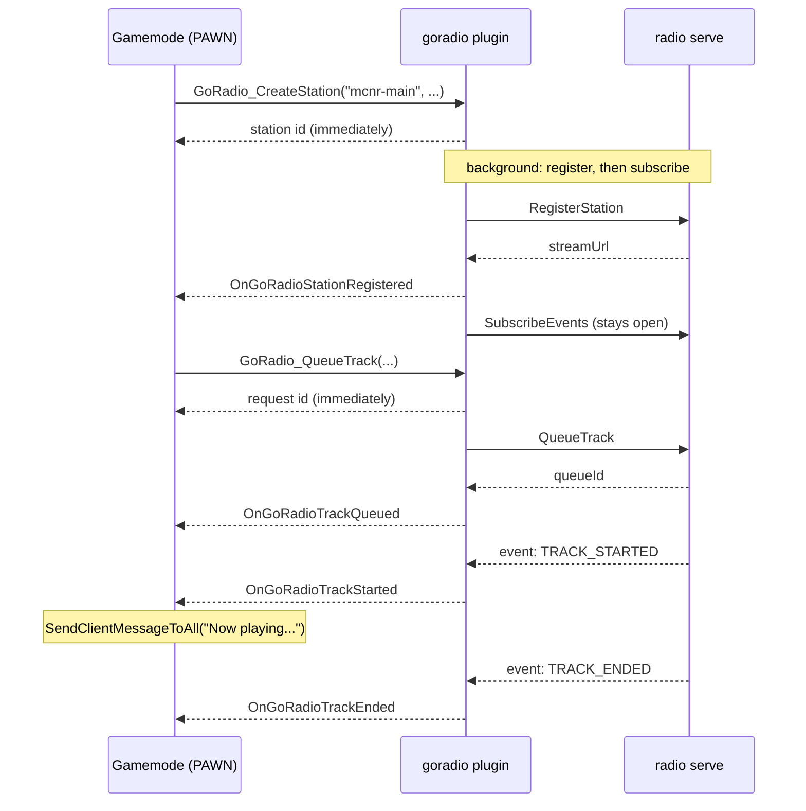

# How It Works — Overview

Three ideas explain almost everything about how this plugin behaves. If
you read nothing else in this section, read this page.

## 1. It is a controller, not an audio player

The audio server (`radio serve`) owns the audio: fetching sources,
decoding, mixing in the silence loop, and streaming to listeners. It keeps
the queue, tracks what's playing, and counts listeners.

This plugin decides *what should play*. It sends commands and receives
events. It never touches audio data, and the SA-MP server is not in the
path between the audio server and a listener — players connect to the
audio server directly.

That division is why a station keeps playing when your gamemode restarts,
and why a restart of the audio server empties the queue but leaves your
gamemode none the wiser unless it is told. See
[Station Lifecycle](station-lifecycle.md).

## 2. Nothing that touches the network runs on the main thread

SA-MP is single-threaded, and a public may only be called from the
server's own thread. So the plugin is split cleanly in two:

- **Natives** run on the main thread. They either read local state or
  drop a job on a queue. None of them ever waits on a socket.
- **Worker and stream threads** do all the HTTP. They never call into
  PAWN. They produce plain-value events and queue them.
- **`ProcessTick`** drains that queue and fires the callbacks, back on
  the main thread.

The visible consequence: **every command is asynchronous**.
`GoRadio_Skip` returns a request id, not whether the skip happened. The
answer arrives in a callback a few milliseconds later. See
[Architecture & Threading](architecture.md).

## 3. Reads are free, because they're cached

The other half of that split is that `GoRadio_GetListenerCount`,
`GoRadio_GetCurrentTrackTitle` and friends do **not** make requests. They
read a local snapshot the plugin keeps current from two sources:

- the **event stream**, which pushes changes as they happen, and
- a periodic **`GetStatus`**, every `goradio_poll_interval` seconds and
  after every track change.

So you can call them in a one-second timer, or per player in a loop,
without thinking about it. The tradeoff is that they can be slightly
behind reality — bounded by the poll interval for the queue and history
lists, and by network latency for everything the event stream covers.

## Putting it together

## In more detail

- **[Architecture & Threading](architecture.md)** — the thread layout,
  how work gets on and off the main thread, and what shutdown does.
- **[Station Lifecycle](station-lifecycle.md)** — registration, reconnect,
  and the empty-queue trap.
- **[Transport](transport.md)** — why HTTP and not gRPC, and how the
  event stream works over HTTP/1.1.
