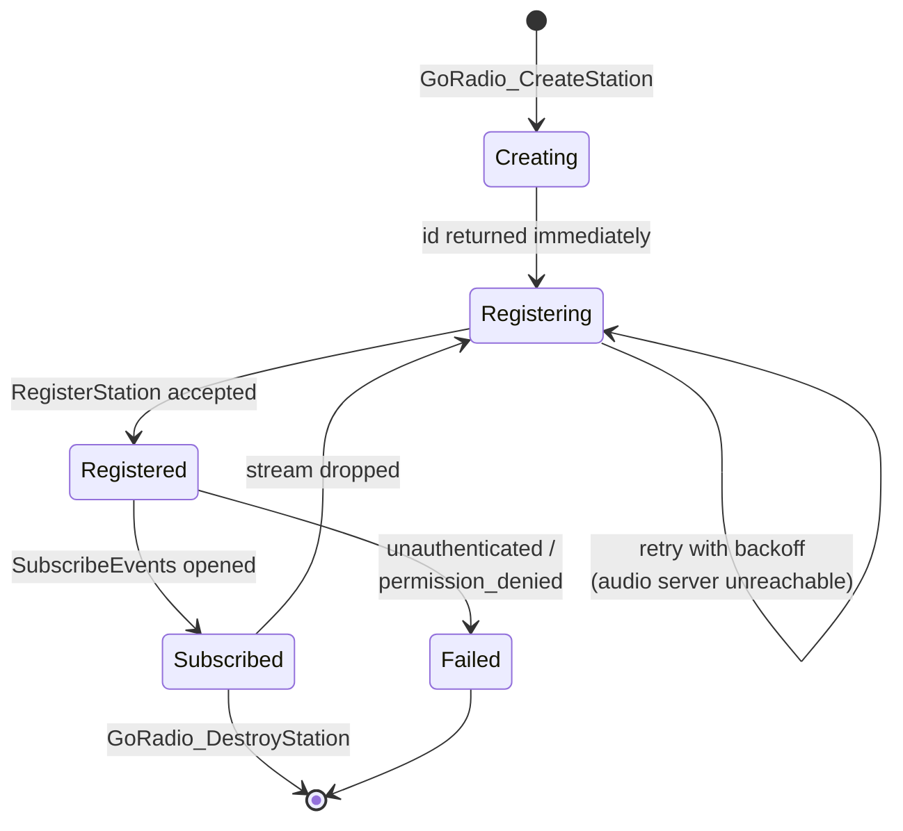

# Station Lifecycle

## The normal path



`GoRadio_CreateStation` returns a station id **immediately**, before
anything has been sent. The id is valid straight away — you can store it,
compare it, pass it around — but the station is not usable until
[`OnGoRadioStationRegistered`](../pawn-api/callbacks.md#ongoradiostationregistered)
fires.

Registration happens on the station's own thread and retries with backoff
until it succeeds. Creating a station while the audio server is down is
fine and expected; it comes up on its own when the server does.

Once registered, the plugin opens the event subscription. Registration
comes first deliberately: `SubscribeEvents` against a slug the audio
server doesn't know is a `not_found`, not a stream that starts working
later.

## Registration is not persistent

This is the fact that everything else on this page follows from:

!!! danger "The audio server keeps station registrations in memory only"
    A `radio serve` restart wipes every registration **and every queue**.
    Nothing is written to disk; nothing is replayed on restart.

When the connection comes back, the plugin re-registers automatically. The
station returns with the same slug, name and metadata — and an **empty
queue**. Playback does not resume, because there is nothing left to play.

## Why re-priming is your job

The plugin cannot refill the queue for you: it doesn't know what your
station plays. So it does the next best thing — it fires
`OnGoRadioStationRegistered` again after every reconnect, with the
information you need to decide.

```pawn
public OnGoRadioStationRegistered(stationid, const streamUrl[], bool:reRegistered,
    bool:afterReconnect)
{
    if (GoRadio_GetQueueLength(stationid) == 0)
        QueueSomeTracks(stationid);
    return 1;
}
```

The two flags tell you what happened:

| `afterReconnect` | `reRegistered` | What it means |
|---|---|---|
| `false` | `false` | First registration at startup. Fresh station, empty queue. |
| `false` | `true` | First registration, but the slug was **already registered** — something else is driving it, or a previous run of your server left it there. Its queue is whatever that left behind. |
| `true` | `true` | Reconnect after a network blip. The audio server never went away; the queue is intact and still playing. |
| `true` | `false` | Reconnect, and the audio server had **never heard of this slug** — it restarted. The queue is empty. |

The queue-length check covers all four without you having to reason about
them, which is why it's the recommended form.

### Why `OnGoRadioQueueLow` doesn't cover this

`OnGoRadioQueueLow` is **edge-triggered**: it fires once when the pending
queue drops to or below your threshold, and not again until the queue
climbs back above it and dips a second time.

A freshly recreated station has been empty since the instant it existed.
It never *transitions* into "low" — so the event never fires. A gamemode
relying on it alone goes silent after an audio-server restart, while
`GoRadio_IsStationRegistered` still reports `true` and nothing looks
wrong.

## What survives what

| Event | Station registration | Queue | Current track | Listeners |
|---|---|---|---|---|
| Gamemode restart (`/gmx`) | Survives | Survives | Keeps playing | Keep listening |
| Filterscript reload | Survives | Survives | Keeps playing | Keep listening |
| SA-MP server restart | Survives until re-created | Survives | Keeps playing | Keep listening |
| Network blip | Re-registered automatically | Survives | Keeps playing | Keep listening |
| `radio serve` restart | Re-registered automatically | **Lost** | Stops | Disconnected |
| `GoRadio_DestroyStation` | Removed | Removed | Stops | Disconnected |

The first three rows are worth dwelling on: **the station outlives your
gamemode**. If your script restarts, the audio server is still playing
whatever was queued, to whoever is listening. `GoRadio_CreateStation` with
the same slug re-attaches to that running station rather than replacing
it — `reRegistered` comes back `true` and the queue is untouched.

That is usually what you want. If you'd rather start clean, call
`GoRadio_ClearQueue(stationid, true)` once you're registered.

## Destroying a station

```pawn
GoRadio_DestroyStation(stationid);
```

Stops the station's threads, then unregisters it on the audio server —
which stops its player, drops the queue, and disconnects anyone listening.
Nothing is persisted, so re-creating the same slug afterwards starts from
scratch.

Whether to destroy stations in `OnFilterScriptExit` / `OnGameModeExit` is
a judgement call:

- **Destroy them** if a station only makes sense while your mode is
  running, or if you're reloading a filterscript during development and
  want a clean slate.
- **Leave them** if you'd rather music kept playing across a `/gmx`. The
  plugin's own `Unload` does not unregister stations — it only stops
  talking to them — so leaving them alone is the default behaviour on a
  full server shutdown too.

## Updating a station without disrupting it

`GoRadio_UpdateStation` re-registers with new details. The audio server
updates the station in place: playback continues, the queue is untouched,
and listeners stay connected.

```pawn
GoRadio_SetStationMetadata(station, "event", "christmas");
GoRadio_UpdateStation(station, "MCNR Main — Festive", "Seasonal music", 3,
    "https://cdn.example.com/art/festive.png");
```

Every argument is **replaced**, not merged — this is a re-registration,
not a patch. That matters because most of them have defaults:

```pawn
// Also clears the description, the low-queue threshold and the logo,
// because those arguments defaulted to "" and 0.
GoRadio_UpdateStation(station, "MCNR Main — Festive");
```

Pass the values you want to keep, not just the ones you're changing.

Metadata is the exception: the plugin remembers it and re-sends it with
every registration, including automatic ones after a reconnect. Change it
with `GoRadio_SetStationMetadata` / `GoRadio_ClearStationMetadata`, then
call `GoRadio_UpdateStation` to push it.
