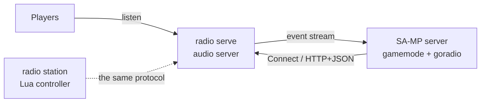

# goradio-samp

A SA-MP server plugin that creates and drives [GoRadio](https://github.com/tmfksoft/goradio)
stations from PAWN.

Your gamemode registers stations, queues tracks, skips, pauses and seeks,
and gets told when tracks start and end — the same capabilities the Lua
station controller has, exposed as natives and callbacks.

```pawn
new station = GoRadio_CreateStation("mcnr-main", "MCNR Main", "The main channel", 3);

public OnGoRadioStationRegistered(stationid, const streamUrl[], bool:reRegistered,
    bool:afterReconnect)
{
    if (GoRadio_GetQueueLength(stationid) == 0)
        GoRadio_QueueTrack(stationid, "music/night-drive.mp3", "Night Drive", "MCNR Radio");
    return 1;
}

public OnGoRadioTrackStarted(stationid, const queueId[], const location[], const title[],
    const artist[], const coverArt[], durationSeconds)
{
    new msg[144];
    format(msg, sizeof(msg), "Now playing: %s - %s", artist, title);
    SendClientMessageToAll(-1, msg);
    return 1;
}
```

## What it does

- **Manages any number of stations** from one server, each with its own
  queue, playlist logic and listener count.
- **Pushes events, doesn't poll.** Track started, track ended, queue low,
  listener count changed — all delivered as callbacks, over a live
  subscription to the audio server.
- **Never blocks a server frame.** Every call that touches the network
  happens on a worker thread; natives return immediately.
- **Survives restarts on both ends.** A station created while the audio
  server is down comes up on its own, and a dropped connection
  re-registers and re-subscribes with backoff.
- **Has no dependencies.** No gRPC, no protobuf, no libcurl, no SDK to
  fetch — the HTTP client, JSON parser and protocol framing are all in
  the plugin.

## Where to start

<div class="grid cards" markdown>

-   :material-download: **[Installation](getting-started/installation.md)**

    Drop in the binary, point it at your audio server.

-   :material-rocket-launch: **[Quickstart](getting-started/quickstart.md)**

    A station playing music in about twenty lines of PAWN.

-   :material-cog: **[How It Works](how-it-works/index.md)**

    The threading model, the station lifecycle, and the transport.

-   :material-book-open-variant: **[PAWN API](pawn-api/index.md)**

    Every native and callback, with the behaviour that isn't obvious.

</div>

## How it fits together



The audio server (`radio serve`) does the actual audio work: fetching,
decoding, mixing and streaming. This plugin is a **controller** — it tells
the audio server what to play and reacts to what happens. It is the same
role the Lua station controller fills, speaking the same protocol, so a
station driven from PAWN is indistinguishable to a listener from one
driven by a Lua script.

!!! info "You do not need this plugin to play radio in SA-MP"
    `PlayAudioStreamForPlayer` can point at any stream URL, including one
    the audio server is already serving. This plugin is for when the
    *gamemode* should decide what plays — a request system, an in-game
    DJ booth, ad breaks tied to server events, per-faction stations. See
    [Playing the Stream In-Game](guides/in-game-playback.md).
